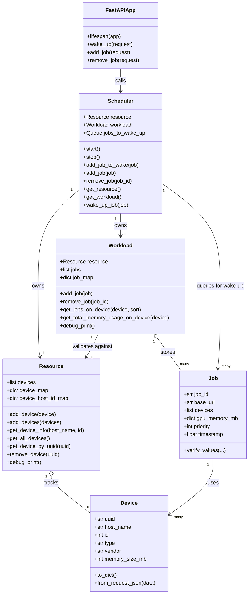

# Job Scheduler

A lightweight FastAPI-based job scheduling service for tracking GPU resources, managing active workload state, and queueing jobs for asynchronous wake-up processing.

## Overview

This project models three core concerns:

- `Resource`: tracks available devices in the system.
- `Workload`: tracks active jobs placed onto devices.
- `Scheduler`: owns a `Resource` and `Workload`, accepts synchronous job mutations, and runs an async queue for wake-up actions.

The API server exposes endpoints for:

- queueing a job to be woken up
- adding a job into active workload state
- removing a job from active workload state

## Project Layout

```text
job_scheduler/
  api_service.py
  resource.py
  scheduler_core.py
  workload.py
tests/
  test_resource.py
  test_scheduler_core.py
  test_workload.py
```

## Core Concepts

### Device

A `Device` represents one GPU or accelerator.

Fields:

- `uuid`
- `host_name`
- `id`
- `type`
- `vendor`
- `memory_size_mb`

### Resource

`Resource` is a singleton-style device registry.

Responsibilities:

- register devices
- look up devices by `(host_name, id)` or `uuid`
- remove devices
- print a debug snapshot grouped by host

### Job

A `Job` represents one scheduled workload.

Fields:

- `job_id`
- `base_url`
- `devices`
- `gpu_memory_mb`
- `priority`
- `timestamp`

Important behavior:

- `gpu_memory_mb` must not be provided in the constructor.
- It is initialized automatically from the attached devices.
- `Job.verify_values(...)` validates constructor-derived state.

### Workload

`Workload` is a singleton-style in-memory registry of active jobs.

Responsibilities:

- atomically add jobs
- atomically remove jobs
- index jobs by device UUID
- compute per-device memory usage
- print a debug snapshot of current jobs and mappings

### Scheduler

`Scheduler` owns both `Resource` and `Workload`.

Responsibilities:

- enqueue jobs into an async wake-up queue
- process queued jobs one-by-one in a background task
- add/remove jobs in active workload state
- expose resource/workload references

## API

The API is implemented in [job_scheduler/api_service.py](job_scheduler/api_service.py).

### `POST /wake_up`

Queue a job into the scheduler wake-up queue.

Request body:

```json
{
  "job_id": "job-1",
  "base_url": "http://worker-a",
  "priority": 5,
  "devices": [
    {
      "uuid": "gpu-1",
      "host_name": "node-1",
      "id": 0,
      "type": "GPU",
      "vendor": "NVIDIA",
      "memory_size_mb": 16000
    }
  ]
}
```

### `POST /add_job`

Add a job directly into active workload state.

### `POST /remove_job`

Remove a job from active workload state.

Request body:

```json
{
  "job_id": "job-1"
}
```

## Lifecycle

The FastAPI app uses a lifespan handler to manage scheduler startup and shutdown.

- app startup: `scheduler.start()`
- app shutdown: `scheduler.stop()`

## Class Relationship Graph



## Installation

```bash
pip install -e .
```

## Running

Start the API server with uvicorn:

```bash
uvicorn job_scheduler.api_service:app --host 0.0.0.0 --port 8000 --log-level info
```

Or run the module entrypoint directly:

```bash
python -m job_scheduler.api_service
```

## Testing

Run the full test suite with:

```bash
pytest
```

Run one file:

```bash
pytest tests/test_scheduler_core.py
```

## Notes

- `Resource` and `Workload` currently use singleton-style instances.
- `Scheduler.wake_up_job` is still a placeholder for the real wake-up implementation.
- Debug helpers use logging rather than direct printing.
