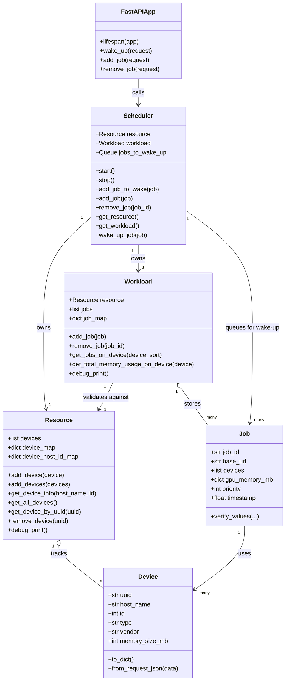

# Job Scheduler

A lightweight FastAPI-based job scheduling service for tracking GPU resources, managing active workload state, and queueing jobs for asynchronous wake-up processing.

## Overview

This project models three core concerns:

- `Resource`: tracks available devices in the system.
- `Workload`: tracks active jobs placed onto devices.
- `Scheduler`: owns a `Resource` and `Workload`, accepts synchronous job mutations, and runs an async queue for wake-up actions.

The API server exposes endpoints for:

- registering devices into resource state
- reading current resource state
- reading current workload state
- queueing a job to be woken up
- adding a job into active workload state
- removing a job from active workload state

## Project Layout

```text
examples/
  interactive_scheduler.py
job_scheduler/
  api_client.py
  api_service.py
  resource.py
  scheduler_core.py
  workload.py
tests/
  test_api_client.py
  test_api_service.py
  test_resource.py
  test_scheduler_core.py
  test_workload.py
```

## Core Concepts

### Device

A `Device` represents one GPU or accelerator.

Fields:

- `uuid`
- `host_name`
- `id`
- `type`
- `vendor`
- `memory_size_mb`

### Resource

`Resource` is a singleton-style device registry.

Responsibilities:

- register devices
- look up devices by `(host_name, id)` or `uuid`
- remove devices
- print a debug snapshot grouped by host

### Job

A `Job` represents one scheduled workload.

Fields:

- `job_id`
- `base_url`
- `devices`
- `gpu_memory_mb`
- `priority`
- `timestamp`

Important behavior:

- `gpu_memory_mb` must not be provided in the constructor.
- It is initialized automatically from the attached devices.
- `Job.verify_values(...)` validates constructor-derived state.

### Workload

`Workload` is a singleton-style in-memory registry of active jobs.

Responsibilities:

- atomically add jobs
- atomically remove jobs
- index jobs by device UUID
- compute per-device memory usage
- print a debug snapshot of current jobs and mappings

### Scheduler

`Scheduler` owns both `Resource` and `Workload`.

Responsibilities:

- enqueue jobs into an async wake-up queue
- process queued jobs one-by-one in a background task
- add/remove jobs in active workload state
- expose resource/workload references

Important behavior:

- rejects `add_job` when `job_id` already exists in workload
- skips enqueue when `job_id` already exists in workload
- skips enqueue when `job_id` is already pending in `jobs_to_wake_up`
- attempts `sleep_jobs(...)` before wake-up if add fails due to capacity constraints
- processes `sleep_jobs(...)` requirements in parallel per virtual device

## API

The API is implemented in [job_scheduler/api_service.py](job_scheduler/api_service.py).

### `GET /resource`

Return the current resource snapshot.

### `GET /workload`

Return the current workload snapshot.

### `POST /add_device`

Register one physical device into `Resource`.

Request body:

```json
{
  "uuid": "gpu-1",
  "host_name": "node-1",
  "id": 0,
  "type": "GPU",
  "vendor": "NVIDIA",
  "memory_size_mb": 16000
}
```

### `POST /wake_up`

Queue a job into the scheduler wake-up queue.

Request body:

```json
{
  "job_id": "job-1",
  "base_url": "http://worker-a",
  "priority": 5,
  "devices": [
    {
      "uuid": "gpu-1",
      "host_name": "node-1",
      "id": 0,
      "type": "GPU",
      "vendor": "NVIDIA",
      "memory_size_mb": 16000
    }
  ]
}
```

### `POST /add_job`

Add a job directly into active workload state.

Response behavior:

- returns `added` when accepted into workload
- returns `rejected` when duplicate `job_id` or resource constraints reject the job

### `POST /remove_job`

Remove a job from active workload state.

Request body:

```json
{
  "job_id": "job-1"
}
```

### Wake-Up Response Notes

`POST /wake_up` returns:

- `scheduled` when the job is newly enqueued
- `ignored` when scheduler skips enqueue because the `job_id` already exists in workload or is already pending in the wake queue

## Clients

The REST clients are implemented in [job_scheduler/api_client.py](job_scheduler/api_client.py).

Available clients:

- `ClientBase`: shared HTTP and payload helpers
- `AdminClient`: general-purpose client for device, resource, workload, add-job, wake-up, and remove-job operations
- `JobClient`: job-scoped client initialized with fixed job information and only allowed to call `wake_up()`

Example:

```python
from job_scheduler import AdminClient, JobClient

admin_client = AdminClient("http://127.0.0.1:8000")
resource = admin_client.get_resource()

job_client = JobClient(
  scheduler_base_url="http://127.0.0.1:8000",
  job_id="job-1",
  base_url="http://job-1",
  devices=[
    {
      "uuid": "gpu-1",
      "host_name": "host_main",
      "id": 0,
      "type": "GPU",
      "vendor": "NVIDIA",
      "memory_size_mb": 12000,
    }
  ],
)
response = job_client.wake_up()
```

## Lifecycle

The FastAPI app uses a lifespan handler to manage scheduler startup and shutdown.

- app startup: `scheduler.start()`
- app shutdown: `scheduler.stop()`

## Class Relationship Graph



## Installation

```bash
pip install -e .
```

## Running

Start the API server with uvicorn:

```bash
uvicorn job_scheduler.api.api_service:app --host 0.0.0.0 --port 8000 --log-level info
```

Or run the module entrypoint directly:

```bash
python -m job_scheduler.api.api_service
```

## Interactive Example

An interactive CLI demo is available at [examples/interactive_scheduler.py](examples/interactive_scheduler.py).

Run it from the project root:

```bash
python examples/interactive_scheduler.py
```

Menu actions include:

- create devices in `Resource`
- start `Scheduler` in debug mode
- add/remove jobs through `Scheduler`
- display current `Resource` and `Workload` snapshots
- enqueue a job for scheduler wake-up processing

Interactive defaults and input features:

- `create_device` defaults:
  - `uuid`: generated incrementally as `d-0`, `d-1`, ...
  - `host_name`: `host_main`
  - `id`: next incremental id for the selected host
  - `type`: `GPU`
  - `vendor`: `NVIDIA`
  - `memory_size_mb`: `8000`
- add/wake flows default `base_url` to `http://<job_id>`
- add/wake flows support virtual requirement mode:
  - user may provide device uuid/id not currently in `Resource`
  - requested `memory_size_mb` may exceed current resource capacity

## Quickstart Examples

For a scripted local environment (start API server, seed 4 devices across `host-0` and `host-1`, create initial jobs via `AdminClient`, and run mock jobs with random sleep/wake behavior), see:

- [examples/quickstart/README.md](examples/quickstart/README.md)
- [examples/quickstart/run_quickstart.sh](examples/quickstart/run_quickstart.sh)
- [examples/quickstart/start_api_server.py](examples/quickstart/start_api_server.py)
- [examples/quickstart/seed_test_env.py](examples/quickstart/seed_test_env.py)
- [examples/quickstart/mock_job.py](examples/quickstart/mock_job.py)

## Testing

Run the full test suite with:

```bash
pytest
```

Run one file:

```bash
pytest tests/test_scheduler_core.py
```

## Notes

- `Resource` and `Workload` currently use singleton-style instances.
- wake/sleep job actions call worker endpoints via HTTP (`<base_url>/wake_up` and `<base_url>/sleep`).
- debug mode overrides wake/sleep implementations with simulated success after timeout.
- debug helpers use logging rather than direct printing.
